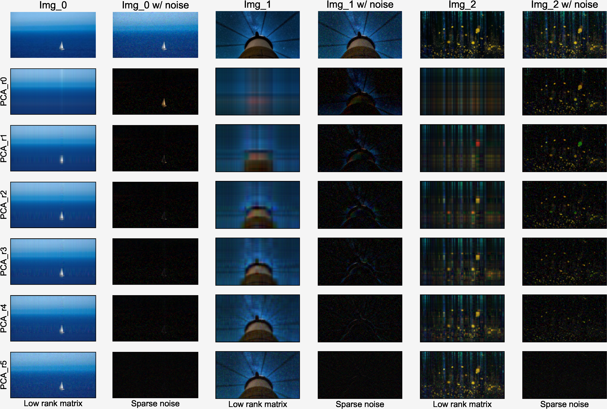
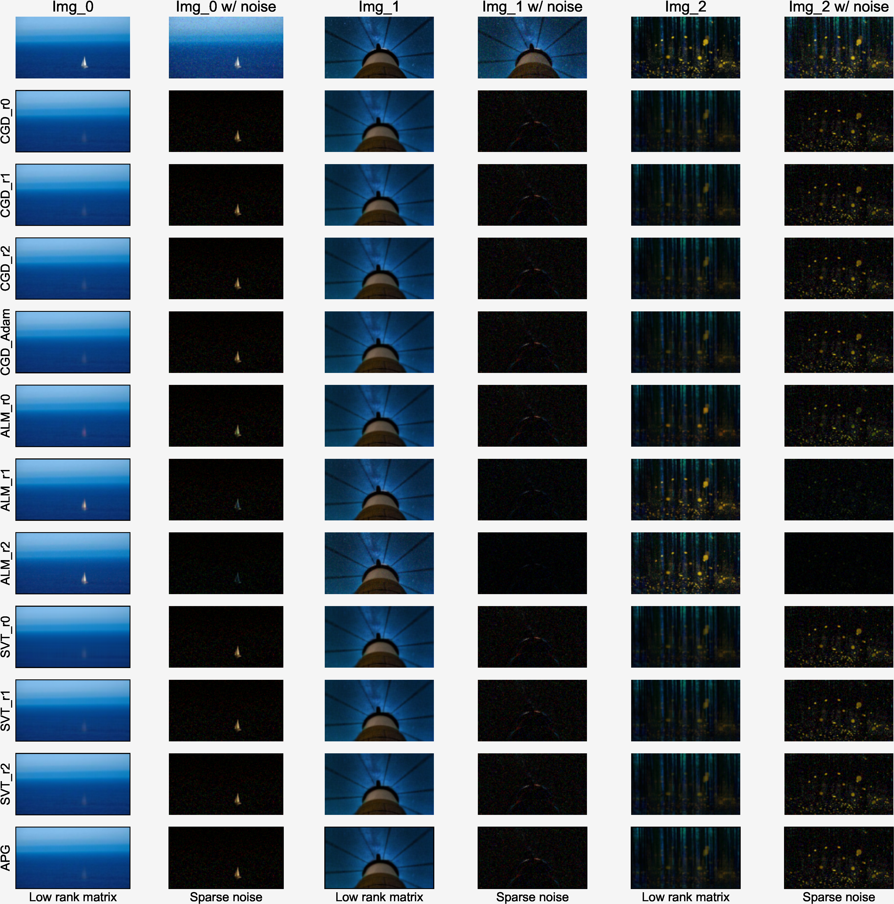
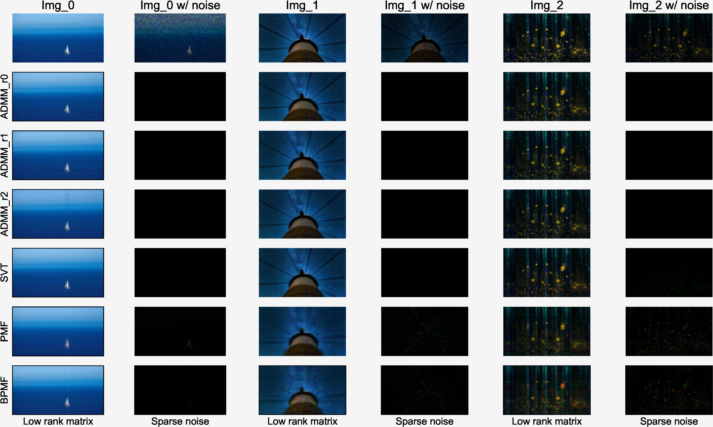
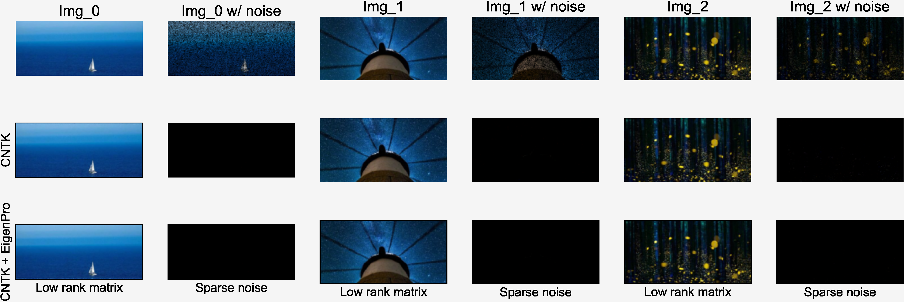

<!-- Author: Jingxuan Yang -->
<!-- E-mail: yangjx20@mails.tsinghua.edu.cn -->

# Low-Rank Matrix Restoration


## Introduction

This project focuses on low-rank matrix restoration with robust principal component analysis (RPCA) and matrix completion (MC). We have implemented the following algorithms.

+ PCA
+ Robust PCA
  + Gradient descent (with Adam)
  + Augmented Lagrange multipliers
  + Accelerated proximal gradient
  + Singular value thresholding
+ Matrix Completion
  + Alternating direction method
  + Singular value thresholding
  + [Probabilistic matrix factorization](https://github.com/tonyduan/matrix-completion)
  + [Biased probabilistic matrix factorization](https://github.com/tonyduan/matrix-completion)
  + [Neural tangent kernels](https://github.com/uhlerlab/ntk_matrix_completion)

## Structure

The directory of this project is listed as follows.

```python
|- bin/
|- data/
|- doc/
|- ntk/
|- pre/
|- utils/
|- README.md
|- requirements.txt
```

## File Descriptions

+ bin/
  + This folder contains the executable code files
+ data/
  + This folder contains images and results
+ doc/
  + This folder contains the report of this project written with LaTeX
+ ntk/
  + This folder is taken from [[link]](https://github.com/uhlerlab/ntk_matrix_completion)
+ pre/
  + This folder contains the presentation slides.
+ utils/
  + This folder contains utilities of this project
+ README.md
  + This file serves as user manual of this project
+ requirements.txt
  + This file contains python packages used in this project

## Quick Start

1. Please install required packages included in `requirements.txt` via `pip`.

```s
~$ pip install -r requirements.txt
```

2. Kindly run `bin/low_rank_re.py` to test all algorithms on images in `data/`.

```s
~$ cd bin
~bin$ python low_rank_re.py
```

3. Please run `bin/results_analysis.ipynb` to analyze the results and plot figures.

## Results

### PCA



### Robust PCA



### Matrix Completion





## References
+ https://github.com/dganguli/robust-pca
+ https://github.com/tonyduan/matrix-completion
+ https://github.com/uhlerlab/ntk_matrix_completion
+ https://github.com/stephenbeckr/fastRPCA
+ https://github.com/dfm/pcp
+ https://github.com/jkarnows/rpcaADMM
+ https://www.dorukhanserg.in/post/implementing-rpca/
+ https://stackoverflow.com/questions/40721260/how-to-use-robust-pca-output-as-principal-component-eigenvectors-from-traditio
+ http://jeankossaifi.com/blog/rpca.html
+ http://blog.shriphani.com/2013/12/18/robust-principal-component-pursuit-background-matrix-recovery/
+ https://github.com/sagarvegad/Adam-optimizer
+ https://people.eecs.berkeley.edu/~yima/matrix-rank/sample_code.html
+ https://zhouchenlin.github.io/

